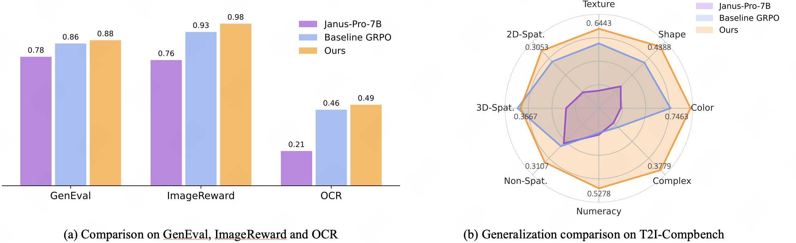
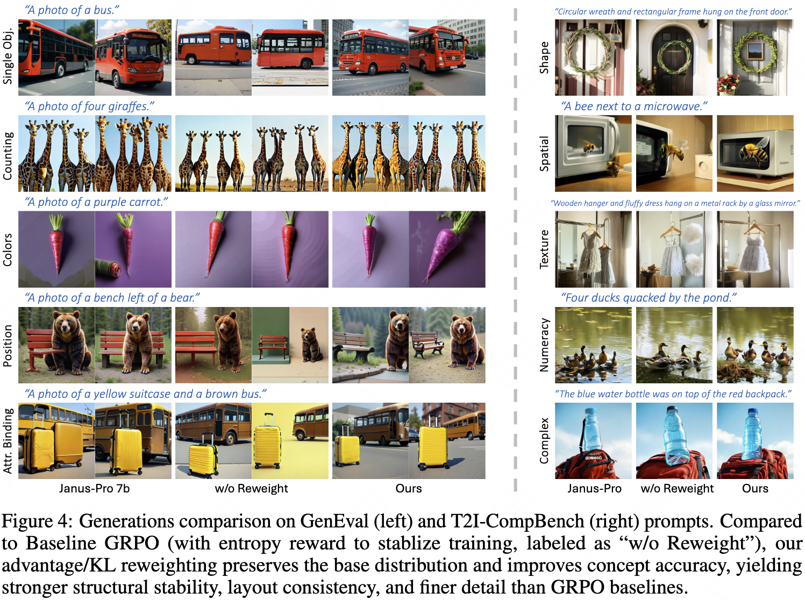
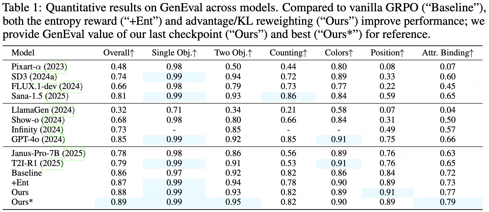
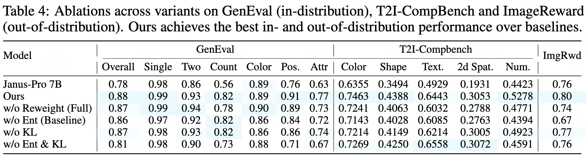

<div align="center">
    <h1> 
        STAGE: Stable and Generalizable GRPO for Autoregressive Image Generation
    </h1>
</div>

<div align="center">
    <a href="https://arxiv.org/abs/2509.25027">
        
    </a>&nbsp;
    <a href="https://huggingface.co/krennic/STAGE">
        
    </a>&nbsp;
    <a href="https://github.com/krennic999/STAGE">
        
    </a>
</div>

## News

- [2025-09] We have released official [Codebase](https://github.com/krennic999/STAGE) and weights at [Hugging Face](https://huggingface.co/krennic/STAGE)!
- [2025-09] STAGE [Technical Report](https://arxiv.org/abs/2509.25027) is released.

##  Introduction
<!-- <b> -->
STAGE is the first system to systematically study the stability and generalization of GRPO-based autoregressive visual generation. 

Built on the original Janus-Pro-7B, STAGE improves the GenEval score from **0.78** to **0.89** (≈14% improvement) while avoiding degradation in image quality, and its effectiveness and generalization are further validated across a wide range of benchmarks, including T2I-Compbench and ImageReward.  

We have also discussed rewards related to human preference and text rendering.
<!-- </b> -->

<div align="center">

</div>
</div>

<details><summary><b>CLICK for Detailed Introduction</b></summary>
Reinforcement learning has recently been explored to improve text-to-image generation, yet applying existing GRPO algorithms to autoregressive (AR) image models remains challenging. The instability of the training process easily disrupts the pretrained model capability during long runs, resulting in marginal gains, degraded image quality, and poor generalization. In this work, we revisit GRPO for AR image generation and identify two key issues: contradictory gradients from unnecessary tokens and unstable policy entropy dynamics. To address these, we introduce STAGE, a stable and generalizable framework that leverages two targeted solutions:

1) Advantage/KL reweighting. Similarity-aware reweighting to alleviate conflicting updates; and 

2) Entropy reward. An entropy-based reward corresponding to reference model to stabilize learning. 

With the help of alleviating conflicts between tokens and an entropy reward for stabilizing training, we reduce disruption of the pretrained distribution and mitigate reward hacking, which in turn improves generalization and transfer better to other benchmarks.
Experiments across multiple benchmarks show that STAGE consistently improves visual quality, stability, and cross-task generalization compared to baseline GRPO.

<!-- <div align="center">

<p>framework of STAR</p>
</div> -->
</details>

### Qualitative Performance
<div style="text-align: center; width: 100%;">
    
</div>

### Quantitative Performance
<div style="text-align: center; width: 100%;">
    
</div>

### Generalization Comparison
<div style="text-align: center; width: 100%;">
    
</div>

<!-- ### More Ablations -->

## Get Started
### Quick Inference
Clone the repository:

   ```bash
   git clone https://github.com/krennic999/STAGE.git
   cd STAGE/src
   ```
Download models at [Huggingface](https://huggingface.co/krennic/STAGE):
| Reward Type   | Hugging Face Link |
|---------------|-------------------|
| GenEval           | [🤗Huggingface](https://huggingface.co/krennic/STAGE/tree/main/geneval_ours) |
| HPS+GiT+Gdino     | [🤗Huggingface](https://huggingface.co/krennic/STAGE/tree/main/hps_gdino_git_ours) |
| OCR | [🤗Huggingface](https://huggingface.co/krennic/STAGE/tree/main/ocr_ours) |


cd into ```grpo/src/infer```, and use:
   ```bash
    python reason_inference.py \
    --model_path YOUR_MODEL_CKPT \
    --data_path test_data.txt 
   ```
Or run ```reason_inference_xxx.py``` for inference on GenEval/HPS/Drawbench/T2I-Compbench/OCR
   ```bash
    torchrun --nnodes=1 --nproc_per_node=8 --node_rank=0 --master_port=29500 reason_inference_xxx.py --model_path your-janus-pro-model --save_root your-save-root
   ```

### Set up the reward model environment for training

   Install GrouningDINO if you want to use Object Detector reward
   ```bash
   cd grpo/src/utils/GroundingDINO
   pip install -e .
   ```
   Install LLaVA if you want to use ORM reward
   ```bash
   cd grpo/src/utils/LLaVA-NeXT
   pip install -e ".[train]"
   ```
Detailed install instructions can be found in [T2I-R1](https://github.com/CaraJ7/T2I-R1)

### Prepare reward model checkpoints

Download corresponding models to your local path, and update your local path to ```grpo/configs/reward_paths.json```:

| Reward Model | Link | Download Command |
|--------------|------|------------------|
| HPS | [HPS_v2.1_compressed.pt](https://huggingface.co/xswu/HPSv2/resolve/main/HPS_v2.1_compressed.pt) | ```wget https://huggingface.co/xswu/HPSv2/resolve/main/HPS_v2.1_compressed.pt``` |
| GIT | [git-large-vqav2](https://huggingface.co/microsoft/git-large-vqav2) | ```huggingface-cli download microsoft/git-large-vqav2 --repo-type model --local-dir git-large-vqav2``` |
| GroundingDINO | [groundingdino_swint_ogc.pth](https://github.com/IDEA-Research/GroundingDINO/releases/download/v0.1.0-alpha/groundingdino_swint_ogc.pth) | ```wget https://github.com/IDEA-Research/GroundingDINO/releases/download/v0.1.0-alpha/groundingdino_swint_ogc.pth``` |
| ORM | [ORM-T2I-R1](https://huggingface.co/CaraJ/ORM-T2I-R1) | ```huggingface-cli download CaraJ/ORM-T2I-R1 --repo-type model --local-dir ORM-T2I-R1``` |
| CLIP | [open-clip](https://huggingface.co/laion/CLIP-ViT-H-14-laion2B-s32B-b79K) | ```huggingface-cli download laion/CLIP-ViT-H-14-laion2B-s32B-b79K --repo-type model --local-dir open-clip``` |

**About how to prepare GenEval reward:**

Based on [Flow-GRPO](https://github.com/yifan123/flow_grpo), we reimplemented an offline version of the GenEval reward:
   ```bash
    git clone https://github.com/djghosh13/geneval.git
    cd geneval
    conda env create -f environment.yml
    conda activate geneval
    ./evaluation/download_models.sh "<OBJECT_DETECTOR_FOLDER>/"

    git clone https://github.com/open-mmlab/mmdetection.git
    cd mmdetection; git checkout 2.x
    pip install -v -e .
   ```
See [GenEval](https://github.com/djghosh13/geneval) for detailed install instruction.

And replace corresponding PATH in ```grpo/configs/reward_paths.json``` with your path:
   ```bash
    default_config = "/your-mmdet-code/mmdetection/configs/mask2former/mask2former_swin-s-p4-w7-224_lsj_8x2_50e_coco.py"
    default_ckpt = "/your-mmdet-ckpt/mmdetection"
    default_clip = "your-clip-ckpt/timm/vit_large_patch14_clip_224.openai/open_clip_pytorch_model.bin"
    default_obj  = "/your-stage-root/STAGE/src/grpo/src/utils/reward-server/reward_server/object_names.txt"
   ```

**How to prepare OCR reward:**
Following Flow-GRPO, install paddle-ocr first, and then set ocr_base_root in ```grpo/configs/reward_paths.json``` to your path of pre-downloaded model:
   ```bash
    ocr_base_root = "/your-paddleocr-root/paddleocr/whl"
   ```

### Training 
For training on different rewards:
```bash
cd grpo/src
python run_training_xxx.py
```

### Evaluation on benchmarks
cd into ```grpo/src/infer```, and run ```reason_inference_xxx.py``` for inference on GenEval/HPS/Drawbench/T2I-Compbench/OCR:
   ```bash
    torchrun --nnodes=1 --nproc_per_node=8 --node_rank=0 --master_port=29500 reason_inference_xxx.py --model_path your-janus-pro-model --save_root your-save-root
   ```

**We provide useful tool for calculate T2I-Compbench score:**

First prepare T2I-Compbench based on the official [repo](https://github.com/Karine-Huang/T2I-CompBench): 
cd into ```into grpo/src/infer```, first replace ```T2I_COMP_CODE_ROOT```in ```./cal_t2i_compbench_value.sh ``` and use:
   ```bash
    ./cal_t2i_compbench_value.sh your-save-root
   ```
and results can be found in corresponding txt file.

For evaluation on OCR, use:
   ```bash
    python cal_ocr_score.py --image_root your-save-root
   ```

## Acknowledgements
We thank [T2I-R1](https://github.com/CaraJ7/T2I-R1) and [Flow-GRPO](https://github.com/yifan123/flow_grpo) for their great work, upon which our repo is built.


## Cite
```
@misc{ma2025stage,
      title={STAGE: Stable and Generalizable GRPO for Autoregressive Image Generation}, 
      author={Xiaoxiao Ma and Haibo Qiu and Guohui Zhang and Zhixiong Zeng and Siqi Yang and Lin Ma and Feng Zhao},
      year={2025},
      eprint={2509.25027},
      archivePrefix={arXiv},
      primaryClass={cs.CV},
      url={https://arxiv.org/abs/2509.25027}, 
}
```